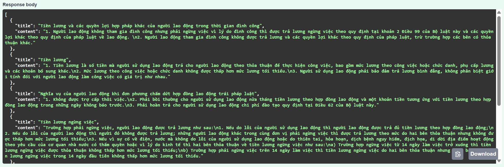

# Installation Guide and Usage Instructions
A simple RESTful API for semantic search of Vietnamese legal documents using FastAPI, Sentence-BERT, and Qdrant.

## Features
- Search Vietnamese legal articles with semantic understanding.
- Uses PhoBERT embeddings (via Sentence-BERT).
- Vector storage & search powered by Qdrant.
- Endpoint /search returns relevant articles (title and content).

## Tech Stack
- FastAPI — Python web API framework
- Sentence-BERT — Vietnamese PhoBERT model for embeddings
- Qdrant — Vector database for similarity search
- Docker — Containerized deployment

## Smart Legal Search Highlights
- Uses state-of-the-art Vietnamese Sentence Embedding models (e.g. PhoBERT, SimCSE) to understand user queries semantically — not just by keywords.
- Implements fast vector similarity search with FAISS or Qdrant for efficient Top-K retrieval.
- Automatically removes duplicate articles and ranks the most relevant results.
- Supports hybrid search: combines semantic similarity and keyword scores for better matching.
- Can be expanded with synonym dictionaries and metadata filters (e.g., filter by specific law types).
- Evaluates search accuracy with simple metrics like Top-K Accuracy to ensure real-world reliability.

## Usage.
### 4.1. Load streamlit tool.
The project is developed using the FastAPI tool. To execute the project:
```bash
docker pull xuanhiepp/legal-search-api:latest
docker run -p 8000:8000 xuanhiepp/legal-search-api:latest
```

Wait about 2-3 minutes until the terminal displays as shown below. 
```bash
INFO:     Started server process
INFO:     Waiting for application startup.
INFO:     Application startup complete.
INFO:     Uvicorn running on http://0.0.0.0:8000 (Press CTRL+C to quit)
```

Since the port is mapped as 8000:8000 in docker-compose.yml, you can open your browser and access the the Swagger API screen at:
http://localhost:8000/docs or http://127.0.0.1:8000/docs

## Example Query.
```
POST /search
{
  "query": "NLĐ bị sa thải có được trả lương hay không?"
}
```
